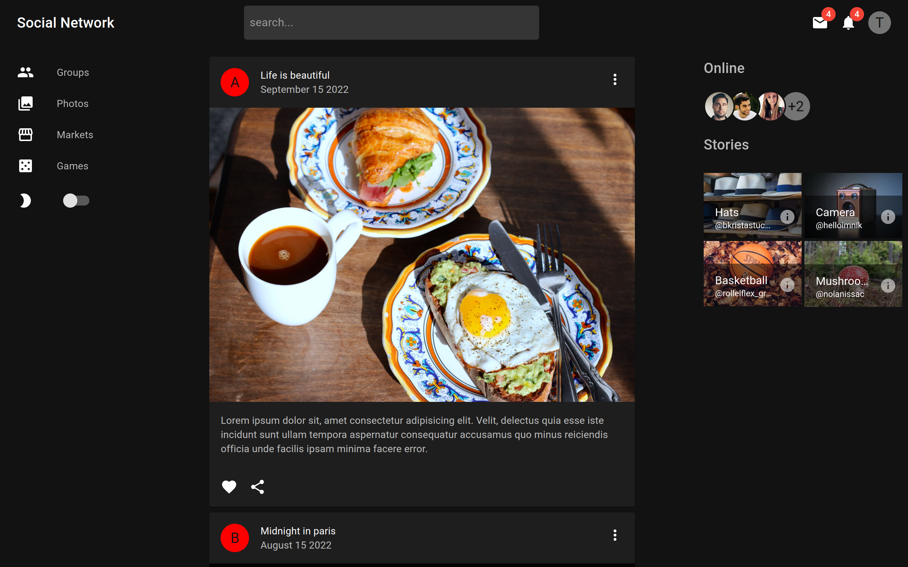
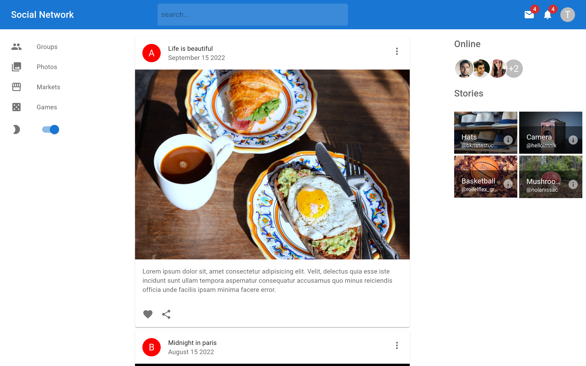
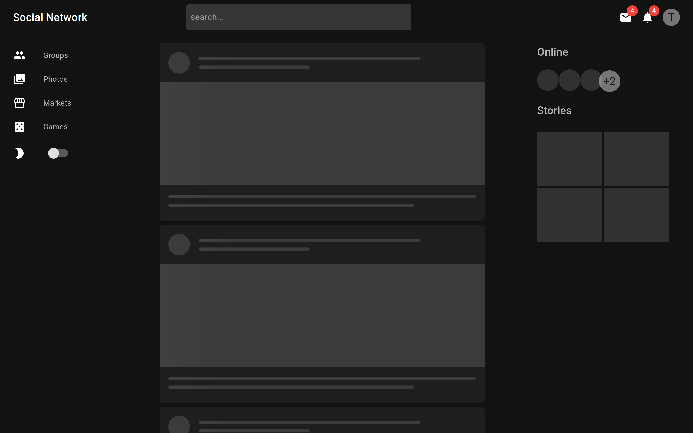
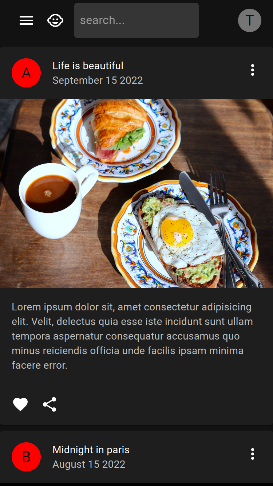
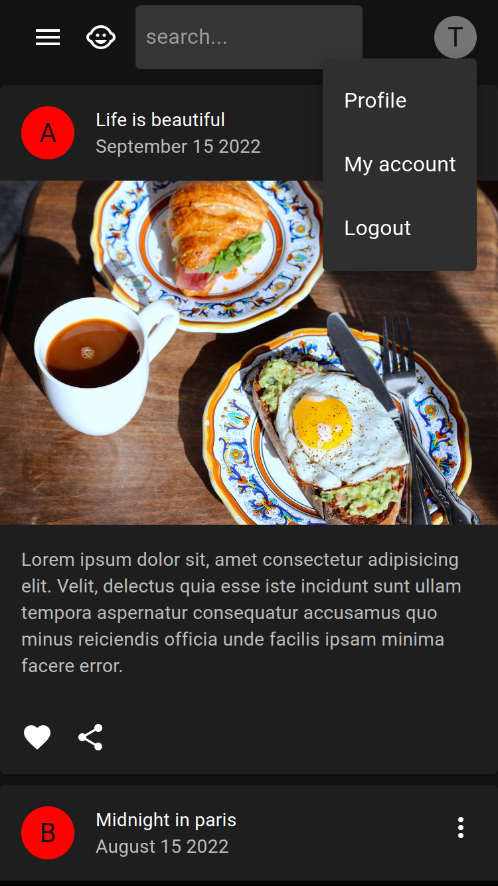
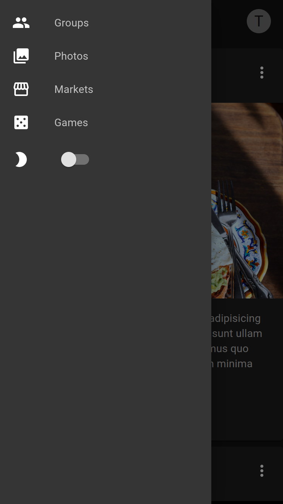

# The Social Network

## Table of Contents

- [About](#about)
- [Features and Stack](#features-and-stack)
- [Screenshots](#screenshots)
- [Getting Started](#getting-started)
- [Future Work](#challenges)
- [Create React App](#bootstrapped-with-create-react-app)

## About

**The Social Network** is a mobile friendly social media platform to share contents with people. 

## Features and Stack

### Features

- fully responsive with support for mobile, tablet and desktop device to increase traffic.
- left bar in desktop, left drawer in mobile and tablet.
- feed card with avatar.
- group avatar for online friends.
- menu for user information.
- skeleton on loading.
- switch to toggle between light and dark theme.
- documented for code maintainability.
- fully automated CI / CD pipeline implemented with github and github actions.
- deployed and hosted in firebase.

### Stack

- React
- Material UI
- firebase
- github
- github actions

## Screenshots

- Landing Page (desktop view)



- Light Theme (desktop view)



- Skeleton Loading (desktop view)



- Landing Page (mobile view)



- Menu (mobile view)



- Drawer (mobile view)



## Getting started

Below you'll find the instructions for setting up the project locally

### Clone repo and install dependencies

```bash
# Clone the repo
gh repo clone neuralchemist/the-social-network

# Install dependencies
cd the-social-network
npm install
```


### Start the app

```bash
# Start development server
npm start
```

The app should be running at: [http://localhost:3000](http://localhost:3000/)

## Future Work

- Setup firstore database for user feeds using firebase backend-as-a-service.
- create an account using email and password
- authenticate using Facebook, GitHub or Google

These are some of the features I want to implement in the future or reuse from some of my other projects.

## Bootstrapped with Create React App

This project was bootstrapped with [Create React App](https://github.com/facebook/create-react-app).

For the detailed description of available scripts see [CRA Documentation](https://create-react-app.dev/docs/available-scripts)
